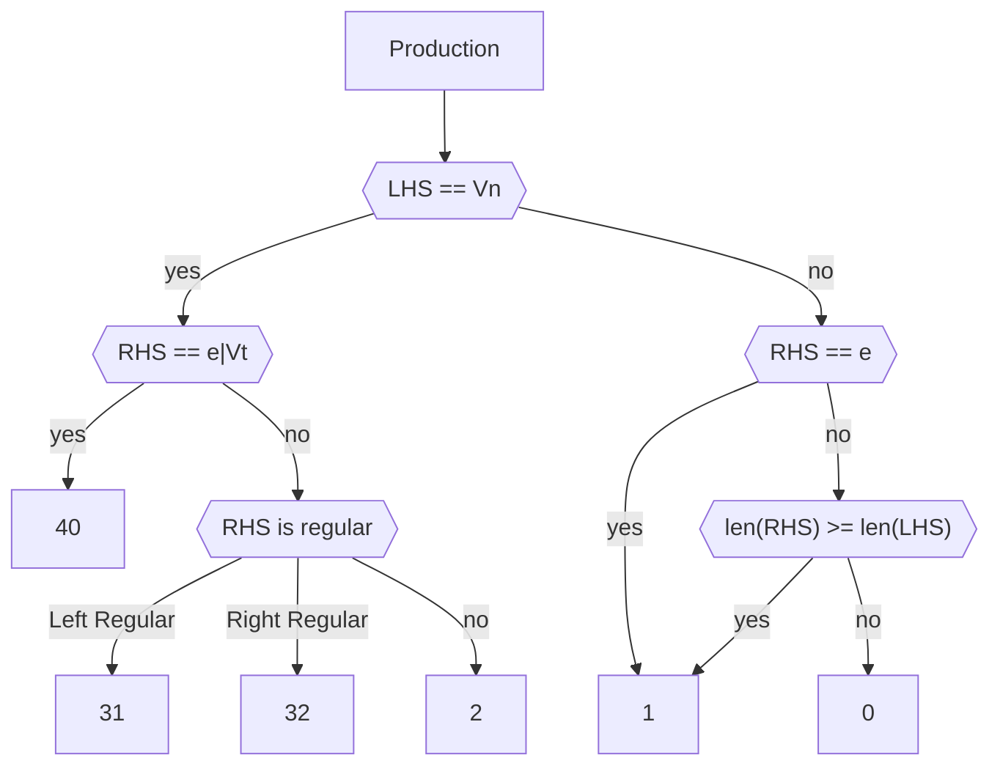
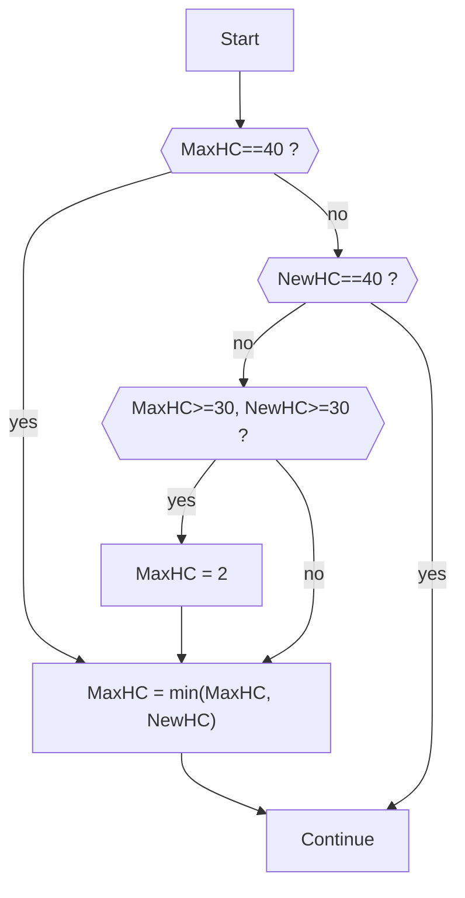

<!-- _footer: ""-->
<!-- _paginate: skip -->

# **Chomsky Hierarchy** Detection

Exp 1, Group 2. \
*AHU 2022, Software Engineering*

---

# 算法原理

---

# Production **Hierarchy Code**

为了便于程序实现，我们在 Chomsky Hierarhcy 法则的基础上，定义了产生式的 Hierarhcy Code ：

```python
HIERARCHY_TEXT: dict[int, str] = {
    0: "Recursive Enumerable",
    1: "Context-sensitive",
    2: "Context-free",
    30: "Regular",
    31: "Left Regular",
    32: "Right Regular",
    40: "Epsilon/Single Terminal",
}
```

---

# Production **Hierarchy Code**

对于一个单独的产生式 $\alpha \to \beta$ ($\alpha, \beta \in V^*$, 且 $\alpha$ 必须包含至少一个$V_N$)，
我们可以根据 Chomsky Hierarchy Rules 确定其 Hierarchy Code。

此后我们用 $HC(P_i)$表示某个产生式 $P_i$ 的 Hierarchy Code，并定义缩写HC。

---


# Production **Hierarchy Code**

这里我们允许空串 $\varepsilon$ 的出现。

值得注意的是，由于以下两种文法：

- 左部为单一 $V_N$，且**右部为空串**的的规则
- 左部为单一 $V_N$，**右部只含有一个 $V_T$** 的规则

可以存在于任何型的文法中，故这里为其分配最大的 $HC(P)=40$。

于此同时，我们将**左正规和右正规文法使用不同 $HC$ (31, 32) 进行区分**。

---

### 可处理的空规则

考虑任意一个乔姆斯基文法 $G=\{V_N, V_T, P, S\}$，其中的一个产生式 $P_i$ 如下：

$$
A \to \varepsilon
$$

我们认为其是一个可处理的空规则，当且仅当：

- $A = S$
- $S$ 不存在于任意产生式 $P_x$ 的右部

---

在代码实现中：

- 不符合第一条规则的文法（$A \neq S$）将会触发 `UnprocessableEpsilonRule` 错误。
- 不符合第二条规则的文法（$S$出现在某产生式右部）将会触发 `EpsilonStartSymbolAtRHS` 错误。

---


---

$$
\begin{aligned}
  S &\to A \\
  A &\to SA | b
\end{aligned}
$$

该文法不会触发错误。虽然 $S$ 作为开始符号，出现在了产生式的右侧（$A \to SA$），可是在这个文法中，**并不存在开始符号推导出空串的产生式 $S \to \varepsilon$**，故仍然是可处理的。

---

我们通过如下逻辑来判断一个产生式的 $HC$：


---



---

# Grammar Hierarchy

在完成$HC$的定义后，我们便可以通过遍历文法中产生式的方式，来确定该文法的 Chomsky Hierarhy。

总体框架如下，对于一个文法 $G=\{V_N, V_T, P, S\}$:

1. 在开始时，**初始化 $MaxHC=40$**
2. **循环遍历$P_i$ （$P_i \in P$）**
   1. 计算当前遍历的 $P_i$ 的 Hierarchy Code: $NewHC = HC(P_i)$
   2. **根据 $NewHC$ 的值进行迭代：$MacHC=Update(MacHC, NewHC)$**
3. 循环结束后，根据 $MaxHC$ 的结果，确定 $G$ 的文法类型。

---

# Grammar Hierarchy: **Pseudo Code**

```python
def calc_grammar_hierarchy(G):
    MaxHC = 40
    
    for Pi in G.P:
        NewHC = HC(Pi)
        MaxHC = update(MaxHC, NewHC)
    
    return determine_hierarchy(MaxHC)
```

接下来需要确定 `update` 函数的逻辑。

---

# Grammar Hierarchy: **Update Logic**

总体上来说，是一个取较小值的过程（但不完全是）
这是由先前对于 $HC$ 的定义，以及 Chomsky Hierarchy 的特点决定的。

让我们回顾一下：

```python
HIERARCHY_TEXT: dict[int, str] = {
    0: "Recursive Enumerable",
    1: "Context-sensitive",
    2: "Context-free",
    30: "Regular",
    31: "Left Regular",
    32: "Right Regular",
    40: "Epsilon/Single Terminal",
}
```

---

# Grammar Hierarchy: **Update Logic Flow Chart**


---



---

# Grammar Hierarchy

最后，我们可以轻易的通过 $MaxHC$ 的终值确定 $G$ 的文法类型。

或者说，此时的 $MaxHC$ 所指向的文法类型，就是该文法 $G$ 的文法类型。

---

# 编程实现 & 数据定义

---

本程序随代码定义了几份数据样例，展示了程序的错误检测能力，以及文法类型判断能力。

测试样例的种类定义如下，其内容可由命名得知：

```python
cases: dict[
    str, Sequence[ChomskyProduction] | Callable[[], Sequence[ChomskyProduction]]
] = {
    "Empty LHS": case_empty_lhs_productions,
    "Invalid LHS": case_invalid_lhs_productions,
    "Recursive Enumerable": case_0_productions,
    "Context-sensitive": case_1_productions,
    "Context-free": case_2_productions,
    "Regular With Different Side": case_3_but_different_side_productions,
    "Regular": case_3_productions,
}
```

---

**写在数据定义说明之前**

本程序为了简化问题，忽略了包括但不限于下方列出的因素：

- 对于文法的开始符号 $S$ 进行考虑。
- 对于无用/有害产生式的处理。

---

考虑下面的例子：

$$
G=\{\{S,A,B,C\},\{a,b,c\},P,S\}
$$

其中，产生式集合如下：

$$
\begin{aligned}
S &\to AB \\
A &\to aA | a \\
B &\to bB | b \\
cCc &\to abcCcba 
\end{aligned}
$$

本程序在运行时，由于不会对于开始符号进行考虑，故无法知道最后一条产生式是不可到达的产生式。

理论上，如果剔除最后一条产生式，本文法应该是正规文法 (Right-regular)。
可是本程序将会把此文法判定为上下文相关 (Context-sensitive) 文法。

---

# Data Definition

为了定义一个新的测试样例，您需要使用自带的非终结符和终结符，或者自己创建这些符号。

本程序中，非终结符和终结符分别使用类 `NonTerminal` 和 `Terminal` 进行表示。下面是一个创建新的符号的例子：

```python
D = NonTerminal("D")
F = NonTerminal("F")
x = Terminal("x")
```

---

# Data Definition

这里注意，`Terminal` 和 `NonTerminal` 均继承自 `Piece`。

当我们想要测试某个 `Piece` 的类型时，可以通过其子类的类型来确定：

```python
if isinstance(x, Terminal):
    return "Terminal"
else:
    return "NonTerminal"
```

此外，通过为 `Piece` 类提供 `__repr__()` 方法，我们得以为各种符号提供良好的可视化体验。

---

然后，您可以使用类 `ChomskyProduction` 来定义一个产生式：

```python
production = ChomskyProduction([D], [xF])
```

这代表 $D \to xF$

---

# Data Definition

完成对于 $V_N,V_T$ 的定义后，您需要定义一个 `list[ChomskyProduction]`，或者定义一个会返回 `list[ChomskyProduction]` 类型的可调用对象( `Callable` )。

> 这里支持 `Callable` 对象，是为了方便对本程序的错误检测能力进行测试。
> 当您尝试定义一个错误的 `ChomskyProduction` 时，程序会立即抛出错误。
> 若您不想这个错误被立即抛出，就需要将此类错误的产生式定义在函数内，并且使用函数返回。
>
> 参见本程序提供的错误检测样例。

---

# Data Definition

定义好您自己的产生式列表后，您可以将其添加到样例字典中，这样，您自己的样例就可以随本程序一起被运行。

```python
cases: dict[
    str, 
    Sequence[ChomskyProduction] | Callable[[], Sequence[ChomskyProduction]]
] = {
    ...
    "My Custom Cases": your_production_list,
}
```

---

# Exception Detection

本程序在遇到不合理的产生式时，可以抛出带有对应错误信息的 Exceptions:

```python
# 在产生式左部没有任何内容时，抛出该错误
class EmptyLHS(Exceptions): ...

# 在产生式左部不存在任何非终结符时，抛出该错误
class InvalidLHS(Exceptions): ...
```

---

至此，本程序的算法实现和主要功能已经介绍完毕。

---

# Screenshot

---


---


---


---


---

所有程序输出均被同时重定向到 `./chomsky_type.log` 以供查阅。


---

# 小组分工

- 程新亮：讨论算法，辅助文档编写。
- 杜意如：讨论算法，辅助文档编写。
- 纪云：讨论算法，辅助文档编写。
- 钱锦程：讨论算法，辅助文档编写。
- 齐子祥：讨论算法，辅助文档编写。
- 周裕佳：讨论算法，辅助文档编写，编写以及测试代码，制作PPT。

---

# 谢谢大家