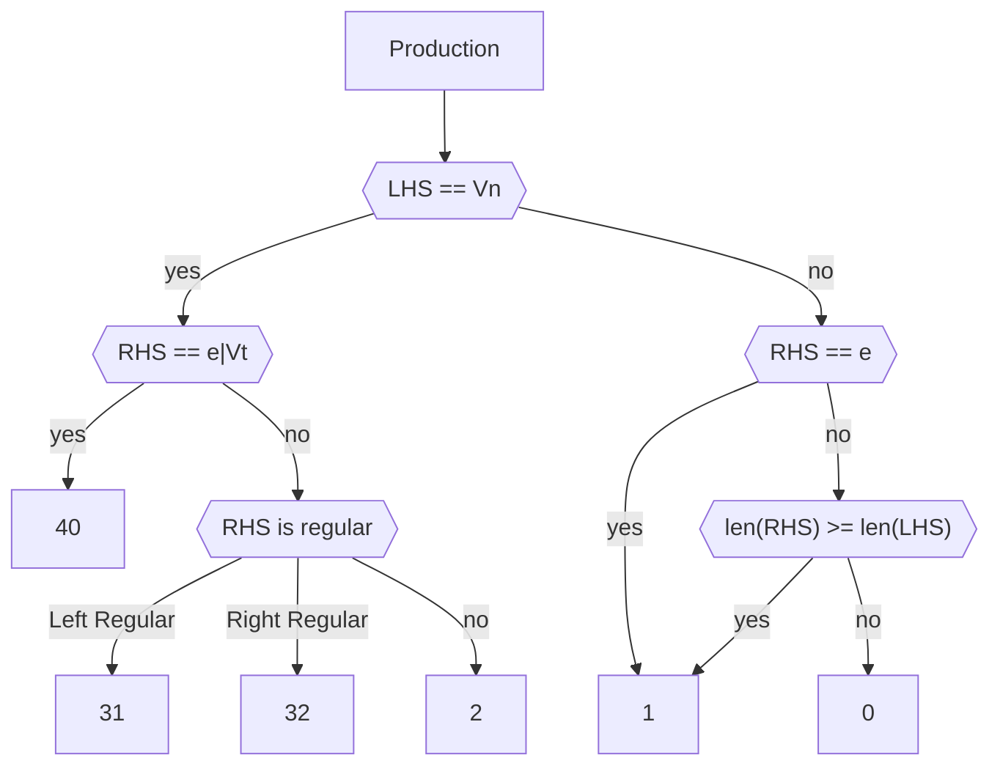
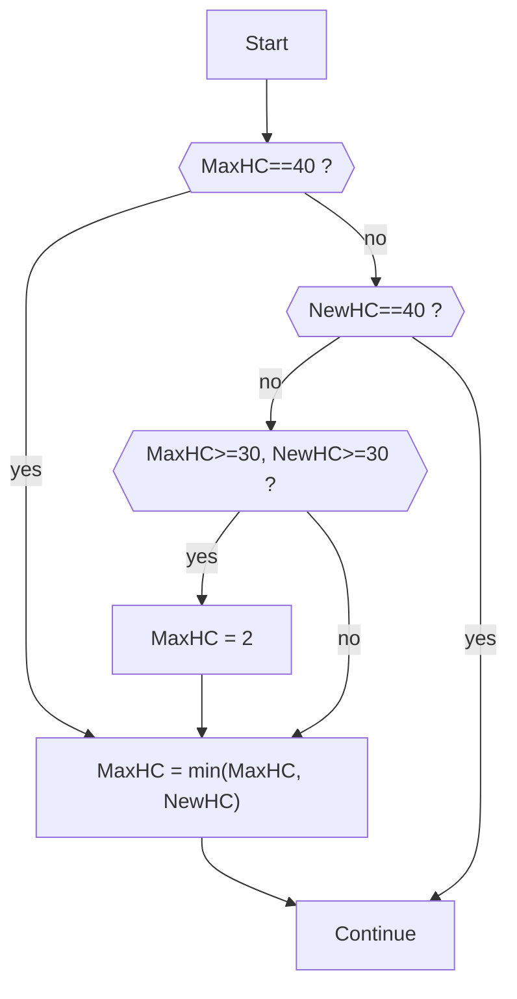

<!-- _footer: ""-->
<!-- _paginate: skip -->

# **Chomsky Hierarchy** Detection

Exp 1, Group 2. \
*AHU 2022, Software Engineering*

---

# 算法原理

---

# 产生式的 Hierarchy Code

对于一个单独的产生式 $\alpha \to \beta$ ($\alpha, \beta \in V^*$, 且 $\alpha$ 必须包含至少一个$V_N$)，
我们可以根据 Chomsky Hierarchy Rules 确定其 Hierarchy Code。

此后我们用 $HC(P)$表示某个产生式的 Hierarchy Code，并定义缩写HC。

---

# Hierarchy Code

为了便于程序实现，我们在 Chomsky Hierarhcy 法则的基础上，定义了产生式的 Hierarhcy Code ：

```python
HIERARCHY_TEXT: dict[int, str] = {
    0: "Recursive Enumerable",
    1: "Context-sensitive",
    2: "Context-free",
    30: "Regular",
    31: "Left Regular",
    32: "Right Regular",
    40: "Epsilon/Single Terminal",
}
```

---

# Hierarchy Code

这里我们允许空串 $\varepsilon$ 的出现。

值得注意的是，由于以下两种文法：

- 左部为单一 $V_N$，且**右部为空串**的的规则
- 左部为单一 $V_N$，**右部只含有一个 $V_T$** 的规则

可以存在于任何型的文法中，故这里为其分配最大的 $HC(P)=40$。

于此同时，我们将**左正规和右正规文法使用不同$HC$进行表示**。

---

我们通过如下逻辑来判断一个产生式的 $HC$：


---



---

# Grammar Hierarchy

在完成$HC$的定义后，我们便可以通过遍历文法中产生式的方式，来确定该文法的 Chomsky Hierarhy。

总体框架如下，对于一个语法 $G=\{V_N, V_T, S, P\}$:

1. 在开始时，**初始化 $MaxHC=40$**
2. **循环遍历$P_i$ （$P_i \in P$**
   1. 计算当前遍历的 $P_i$ 的 Hierarchy Code: $NewHC = HC(P_i)$
   2. **根据 $NewHC$ 的值进行迭代：$MacHC=Update(MacHC, NewHC)$**
3. 循环结束后，根据 $MaxHC$ 的结果，确定 $G$ 的文法类型。

---

# Grammar Hierarchy: Pseudo Code

```python
def calc_grammar_hierarchy(G):
    MaxHC = 40
    
    for Pi in G.P:
        NewHC = HC(Pi)
        MaxHC = update(MaxHC, NewHC)
    
    return determine_hierarchy(MaxHC)
```

接下来需要确定 `update` 函数的逻辑。

---

# Update Logic

总体上来说，是一个取较小值的过程（但不完全是）
这是由先前对于 $HC$ 的定义，以及 Chomsky Hierarchy 的特点决定的。

让我们回顾一下：

```python
HIERARCHY_TEXT: dict[int, str] = {
    0: "Recursive Enumerable",
    1: "Context-sensitive",
    2: "Context-free",
    30: "Regular",
    31: "Left Regular",
    32: "Right Regular",
    40: "Epsilon/Single Terminal",
}
```

---

# Update Logic: **Flow Chart**


---

# Update Logic: **Flow Chart Mermaid Code**



---

最后，我们可以轻易的通过 $MaxHC$ 的终值确定 $G$ 的文法类型。

或者说，此时的 $MaxHC$ 所指向的文法类型，就是该文法 $G$ 的文法类型。

---

# Exception Detection

本程序在遇到不合理的产生式时，可以抛出带有对应错误信息的 Exceptions:

```python
# 在产生式左部没有任何内容时，抛出该错误
class EmptyLHS(Exceptions): ...

# 在产生式左部不存在任何非终结符时，抛出该错误
class InvalidLHS(Exceptions): ...
```

---

# Test Cases

本程序随代码定义了几份数据样例，展示了程序的错误检测能力，以及文法类型判断能力。

测试样例的种类定义如下，其内容可由命名得知：

```python
cases: dict[
    str, Sequence[ChomskyProduction] | Callable[[], Sequence[ChomskyProduction]]
] = {
    "Empty LHS": case_empty_lhs_productions,
    "Invalid LHS": case_invalid_lhs_productions,
    "Recursive Enumerable": case_0_productions,
    "Context-sensitive": case_1_productions,
    "Context-free": case_2_productions,
    "Regular With Different Side": case_3_but_different_side_productions,
    "Regular": case_3_productions,
}
```

---

# Data Definition

为了定义一个新的测试样例，您需要使用自带的非终结符和终结符，或者自己创建这些符号。

本程序中，非终结符和终结符分别使用类 `NonTerminal` 和 `Terminal` 进行表示。下面是一个创建新的符号的例子：

```python
D = NonTerminal("D")
F = NonTerminal("F")
x = Terminal("x")
```

然后，您可以使用类 `ChomskyProduction` 来定义一个产生式：

```python
production = ChomskyProduction([D], [xF])
```

这代表 $D \to xF$

---

# Data Definition

完成对于 $V_N,V_T$ 的定义后，您需要定义一个 `list[ChomskyProduction]`，或者定义一个会返回 `list[ChomskyProduction]` 类型的可调用对象( `Callable` )。

> 这里支持 `Callable` 对象，是为了方便对本程序的错误检测能力进行测试。
> 当您尝试定义一个错误的 `ChomskyProduction` 时，程序会立即抛出错误。
> 若您不想这个错误被立即抛出，就需要将此类错误的产生式定义在函数内，并且使用函数返回。
>
> 参见本程序提供的错误检测样例。

---

# Data Definition

定义好您自己的产生式列表后，您可以将其添加到样例字典中，这样，您自己的样例就可以随本程序一起被运行。

```python
cases: dict[
    str, 
    Sequence[ChomskyProduction] | Callable[[], Sequence[ChomskyProduction]]
] = {
    ...
    "My Custom Cases": your_production_list,
}
```

---

至此，本程序的算法实现和主要功能已经介绍完毕。

---

# 谢谢大家