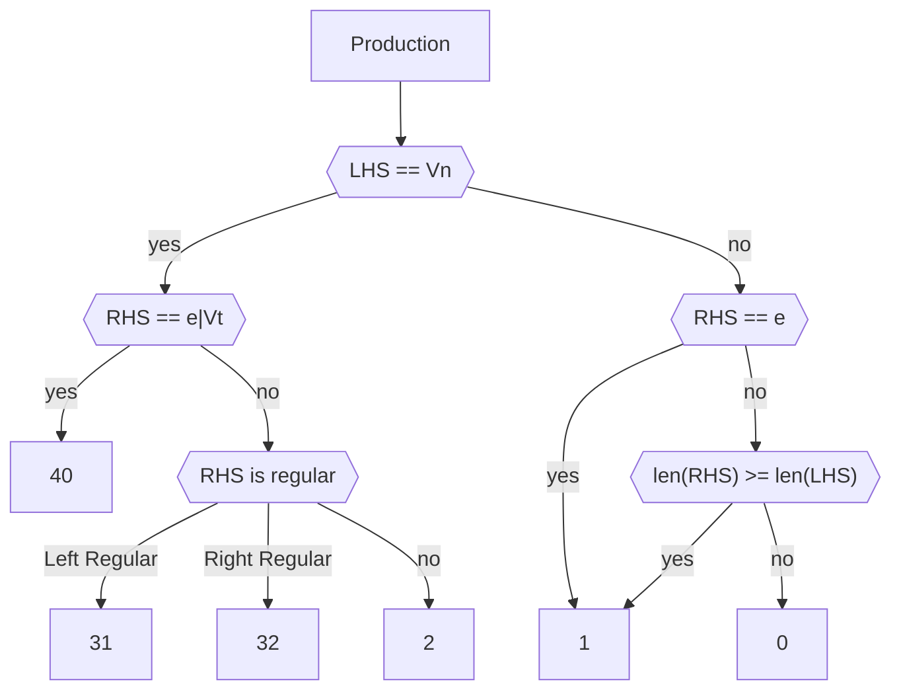
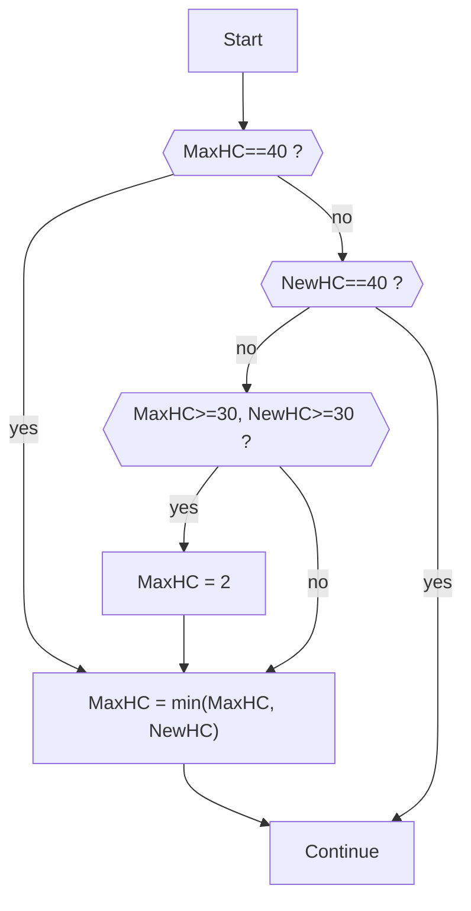

# 乔姆斯基文法类型判断

## 算法原理

### 文法类型的定义

根据所学知识，我们知道，对于一个文法，其乔姆斯基文法类型通过如下方式定义：


故一种容易想到的思路是通过逐个检查文法中包含的产生式所符合的文法类型，来最终确定整个文法的类型。

### Hierarchy Code 的定义

为了便于程序实现，我们在 Chomsky Hierarhcy 法则的基础上，定义了产生式的 Hierarhcy Code ：

```python
HIERARCHY_TEXT: dict[int, str] = {
    0: "Recursive Enumerable",
    1: "Context-sensitive",
    2: "Context-free",
    30: "Regular",
    31: "Left Regular",
    32: "Right Regular",
    40: "Epsilon/Single Terminal",
}
```

对于一个单独的产生式 $\alpha \to \beta$ ($\alpha, \beta \in V^*$, 且 $\alpha$ 必须包含至少一个$V_N$)，
我们可以根据 Chomsky Hierarchy Rules 确定其 Hierarchy Code。

此后我们用 $HC(P_i)$表示某个产生式 $P_i$ 的 Hierarchy Code，并定义缩写HC。

### 特殊的产生式

这里我们允许空串 $\varepsilon$ 的出现。

值得注意的是，由于以下两种文法：

- 左部为单一 $V_N$，且**右部为空串**的的规则
- 左部为单一 $V_N$，**右部只含有一个 $V_T$** 的规则

可以存在于任何型的文法中，故这里为其分配最大的 $HC(P)=40$。

于此同时，我们将**左正规和右正规文法使用不同 $HC$ (31, 32) 进行区分**。

我们通过如下逻辑来判断一个产生式的 $HC$：


上图的 `mermaid` 代码如下：



### 文法类型

在完成$HC$的定义后，我们便可以通过遍历文法中产生式的方式，来确定该文法的 Chomsky Hierarhy。

总体框架如下，对于一个文法 $G=\{V_N, V_T, P, S\}$:

1. 在开始时，**初始化 $MaxHC=40$**
2. **循环遍历$P_i$ （$P_i \in P$）**
   1. 计算当前遍历的 $P_i$ 的 Hierarchy Code: $NewHC = HC(P_i)$
   2. **根据 $NewHC$ 的值进行迭代：$MacHC=Update(MacHC, NewHC)$**
3. 循环结束后，根据 $MaxHC$ 的结果，确定 $G$ 的文法类型。

伪代码如下：

```python
def calc_grammar_hierarchy(G):
    MaxHC = 40
    
    for Pi in G.P:
        NewHC = HC(Pi)
        MaxHC = update(MaxHC, NewHC)
    
    return determine_hierarchy(MaxHC)
```

接下来需要确定 `update` 函数的逻辑。

#### Update Function

总体上来说，是一个取较小值的过程（但不完全是）
这是由先前对于 $HC$ 的定义，以及 Chomsky Hierarchy 的特点决定的。

让我们回顾一下：

```python
HIERARCHY_TEXT: dict[int, str] = {
    0: "Recursive Enumerable",
    1: "Context-sensitive",
    2: "Context-free",
    30: "Regular",
    31: "Left Regular",
    32: "Right Regular",
    40: "Epsilon/Single Terminal",
}
```

`update()` 函数的逻辑图示如下：


上图的 `mermaid` 代码如下：



最后，我们可以轻易的通过 $MaxHC$ 的终值确定 $G$ 的文法类型。

或者说，此时的 $MaxHC$ 所指向的文法类型，就是该文法 $G$ 的文法类型。（特别的，当 $MaxHC=40$ 时，认为该文法为正规文法）

## 编程实现 & 数据定义

本程序随代码定义了几份数据样例，展示了程序的错误检测能力，以及文法类型判断能力。

测试样例的种类定义如下，其内容可由命名得知：

```python
cases: dict[
    str, Sequence[ChomskyProduction] | Callable[[], Sequence[ChomskyProduction]]
] = {
    "Empty LHS": case_empty_lhs_productions,
    "Invalid LHS": case_invalid_lhs_productions,
    "Recursive Enumerable": case_0_productions,
    "Context-sensitive": case_1_productions,
    "Context-free": case_2_productions,
    "Regular With Different Side": case_3_but_different_side_productions,
    "Regular": case_3_productions,
}
```

**写在数据定义说明之前**

本程序为了简化问题，忽略了包括但不限于下方列出的因素：

- 对于文法的开始符号 $S$ 进行考虑。
- 对于无用/有害产生式的处理。

考虑下面的例子：

$$
G=\{\{S,A,B,C\},\{a,b,c\},P,S\}
$$

其中，产生式集合如下：

$$
\begin{aligned}
S &\to AB \\
A &\to aA | a \\
B &\to bB | b \\
cCc &\to abcCcba 
\end{aligned}
$$

本程序在运行时，由于不会对于开始符号进行考虑，故无法知道最后一条产生式是不可到达的产生式。

理论上，如果剔除最后一条产生式，本文法应该是正规文法 (Right-regular)。
可是本程序将会把此文法判定为上下文相关 (Context-sensitive) 文法。

### 数据定义

#### 符号的定义

为了定义一个新的测试样例，您需要使用自带的非终结符和终结符，或者自己创建这些符号。

本程序中，非终结符和终结符分别使用类 `NonTerminal` 和 `Terminal` 进行表示。下面是一个创建新的符号的例子：

```python
D = NonTerminal("D")
F = NonTerminal("F")
x = Terminal("x")
```

这里注意，`Terminal` 和 `NonTerminal` 均继承自 `Piece`。

当我们想要测试某个 `Piece` 的类型时，可以通过其子类的类型来确定：

```python
if isinstance(x, Terminal):
    return "Terminal"
else:
    return "NonTerminal"
```

此外，通过为 `Piece` 类提供 `__repr__()` 方法，我们得以为各种符号提供良好的可视化体验。

#### 产生式的定义

然后，您可以使用类 `ChomskyProduction` 来定义一个产生式：

```python
production = ChomskyProduction([D], [xF])
```

这代表 $D \to xF$

完成对于 $V_N,V_T$ 的定义后，您需要定义一个 `list[ChomskyProduction]`，或者定义一个会返回 `list[ChomskyProduction]` 类型的可调用对象( `Callable` )。

> 这里支持 `Callable` 对象，是为了方便对本程序的错误检测能力进行测试。
> 当您尝试定义一个错误的 `ChomskyProduction` 时，程序会立即抛出错误。
> 若您不想这个错误被立即抛出，就需要将此类错误的产生式定义在函数内，并且使用函数返回。
>
> 参见本程序提供的错误检测样例。


#### 添加自定义样例

定义好您自己的产生式列表后，您可以将其添加到样例字典中，这样，您自己的样例就可以随本程序一起被运行。

```python
cases: dict[
    str, 
    Sequence[ChomskyProduction] | Callable[[], Sequence[ChomskyProduction]]
] = {
    ...
    "My Custom Cases": your_production_list,
}
```

#### 错误检测能力

本程序在遇到不合理的产生式时，可以抛出带有对应错误信息的 Exceptions:

```python
# 在产生式左部没有任何内容时，抛出该错误
class EmptyLHS(Exceptions): ...

# 在产生式左部不存在任何非终结符时，抛出该错误
class InvalidLHS(Exceptions): ...
```

#### 从命令行输入样例

为了提供更加方便的样例输入，本程序支持直接从命令行输入信息来生成样例，示例如下：


### 运行演示

针对于随代码附上的几个样例，部分运行结果如下图所示：


上图详细展示了本文上面提到的功能，如错误检测，产生式类型判断，文法类型判断等等。

#### 完整代码实现

如果您想阅读本程序的代码，可以直接在 GitHub 上进行查阅：

- [本程序入口代码 grammar_type.py](https://github.com/Oya-Learning-Notes/Compilers/blob/main/code/py_impl/exp/1_chomsky_grammar/chomsky_type.py)
- [本程序核心类代码 cfg.grammer_type](https://github.com/Oya-Learning-Notes/Compilers/blob/main/code/py_impl/packages/cfg/grammar_type.py)

> 访问 GitHub 可能需要特殊的网络环境，故本实验报告将在最后附上上述两份代码。

本程序实际上是基于我正在尝试编写的一系列编译原理相关程序的Package之上的程序，故如果想要在本地运行此程序，您可能需要完成的克隆[这个项目](https://github.com/Oya-Learning-Notes/Compilers/tree/main/code/py_impl)，并根据[本项目的安装文档](https://github.com/Oya-Learning-Notes/Compilers/blob/main/code/py_impl/doc/install.md)正确的配置环境。

当完成上述步骤后，您便可以通过下方指令运行本程序：

```shell
cd ./exp/1_chomsky_grammar
python chomsky_type.py
```

## 实验心得

通过本次实验，我对于乔姆斯基的文法类型有了一个更深的理解，也加深了对于文法类型判断方式的理解。于此同时，通过自己实现一个判断程序，在提高代码实现能力的同时，也对课堂中学到的理论知识进行了实践，更加加深了对于理论的理解。

# 附件

## grammar_type.py

```python
import sys
from loguru import logger
from os import environ

from cfg.grammar_type import (
    run_example_cases,
    ChomskyGrammarSystem,
    ChomskyProduction,
    Piece,
    NonTerminal,
    Terminal,
    HIERARCHY_TEXT,
)

# suppress default logger
logger.remove()

# custom logger format
# simplified for this program
fmt = (
    # "<green>{time:YYYY-MM-DD HH:mm:ss.SSS}</green> | "
    "<level>{level: <8}</level> | "
    # "<cyan>{name}</cyan>:"
    # "<cyan>{function}</cyan>:<cyan>{line}</cyan> - "
    "<level>{message}</level>"
)

# add custom logger
logger.add(sys.stderr, format=fmt, level="DEBUG")

# set up file logger.
logger.add("./chomsky_type.log", format=fmt, level="DEBUG")


def run_test():
    # run test cases
    run_example_cases()

    # success
    logger.success("All cases executed")


def chomsky_grammar_input() -> ChomskyGrammarSystem:
    """
    Prompt user to input a chomsky grammar from command line
    """
    productions: list[ChomskyProduction] = []
    used_pieces: dict[str, Piece] = {}

    while True:
        production_str = input(
            "Input a production (E.g.: ABC->aBc) (Input 0 or empty line to finish): \n"
        )

        production_str = production_str.replace(",", "").replace("\\e", "")

        # input end
        if production_str == "" or production_str == "0":
            break

        # convert production str to production
        try:
            productions.append(
                convert_string_to_production(production_str, used_pieces)
            )
        except Exception as e:
            logger.error(f"Invalid production string: {production_str}")
            logger.error(e)
            logger.error("Please input again")
            continue

    # get entry production
    entry: NonTerminal | None = None
    while True:
        entry_str = input("Input the start symbol: \n")
        try:
            entry = used_pieces[entry_str]  # type: ignore
            assert isinstance(
                entry, NonTerminal
            ), "Input symbol is not a non-terminal(Vn)"
            break
        except Exception as e:
            logger.error(f"Invalid start symbol: {entry_str}")
            logger.error(e)
            logger.error("Please input again")

    # construct grammar
    return ChomskyGrammarSystem(
        entry=entry, productions=productions, pieces=list(used_pieces.values())
    )


def convert_string_to_production(
    production_str: str,
    used_pieces: dict[str, Piece],
) -> ChomskyProduction:
    """
    Convert a production string to a ChomskyProduction,
    also update used_pieces in place.
    """
    # split production string
    left, right = production_str.split("->")
    left = left.strip()
    right = right.strip()

    def string_to_pieces(string: str) -> list[Piece]:
        pieces_for_str: list[Piece] = []

        # return empty list
        if string == "":
            return pieces_for_str

        nonlocal used_pieces

        for c in string:
            if c.isupper():
                used_pieces.setdefault(c, NonTerminal(c))
            else:
                used_pieces.setdefault(c, Terminal(c))

            pieces_for_str.append(used_pieces[c])

        return pieces_for_str

    return ChomskyProduction(string_to_pieces(left), string_to_pieces(right))


def main():
    run_test()

    logger.info("Pre-defined test finished, result as above. ")
    logger.info("Now you can input and test your own grammar. ")

    while True:
        try:
            grammar = chomsky_grammar_input()
        except KeyboardInterrupt:
            return 0
        except:
            logger.error("Failed to input a chomsky grammar, please try again")
            continue

        logger.info(f"Grammar:\n {grammar}")
        logger.success(
            f"Grammar Chomsky Hierarchy: {HIERARCHY_TEXT[grammar.chomsky_hierarchy]} ({grammar.chomsky_hierarchy})"
        )


if __name__ == "__main__":
    main()
```

## cfg.grammar_type

> Core feature logic code, including classes and built-in test cases.

```python
"""
Including tools to check the chomsky grammar type of certain grammar system.
"""

import traceback
from collections.abc import Sequence, Callable
from functools import cached_property

from rich import print as rprint
from rich.pretty import pprint as rpprint
from rich.pretty import pretty_repr

from loguru import logger

from .type import Piece, NonTerminal, Terminal, Derivation


class ChomskyGrammarError(Exception):
    """
    Raised when failed to check the chomsky grammar type of the `ChomskyGrammarSystem`
    """

    name: str
    message: str

    def __init__(self, name: str, message: str):
        self.name = name
        self.message = message
        super().__init__(message)

    def __repr__(self):
        return f"{self.message} ({self.name})"


class EmptyLHS(ChomskyGrammarError):
    def __init__(self):
        super().__init__(
            "empty_left_hand_side",
            "A valid chomsky production must have a non-empty left-hand side",
        )


class InvalidLHS(ChomskyGrammarError):
    def __init__(self):
        super().__init__(
            name="invalid_left_hand_side",
            message="Left-hand side of a chomsky grammar must contain at least one non-terminal",
        )


class ChomskyProduction:
    """
    This class is used to represent a general chomsky grammar, and
    currently only used for the feature of checking grammer systems chomsky level.

    For grammar system class used in Lexical Analyzer and Parser, please
    check out `cfg.CFGSystem`

    Also this class should be considered immutable once created, and some cached_property
    is used.
    """

    def __init__(self, source: Sequence[Piece], target: Sequence[Piece]):
        self.source: Sequence[Piece] = source
        self.target: Sequence[Piece] = target

        # check production validity
        self.check_validity()

    def __repr__(self):
        source_str = ""
        for s in self.source:
            source_str += str(s)

        target_str = ""
        for t in self.target:
            target_str += str(t)

        if target_str == "":
            target_str = "\\e"

        return f"{source_str} -> {target_str}"

    def check_validity(self) -> None:
        # left-hand side must not be empty
        if self.lhs_len == 0:
            raise EmptyLHS()

        # lhs must contains at least one non-terminal
        has_non_terminal = False
        for p in self.source:
            if isinstance(p, NonTerminal):
                has_non_terminal = True
                break

        if not has_non_terminal:
            raise InvalidLHS()

    def is_rhs_epsilon(self) -> bool:
        """
        Return True if the right hand side of this production is epsilon
        (empty string)
        """
        return len(self.target) == 0

    @property
    def lhs_len(self):
        return len(self.source)

    @property
    def rhs_len(self):
        return len(self.target)

    @cached_property
    def chomsky_hierarchy(self) -> int:
        """
        Return the chomsky hierarchy of this production

        - 40: Empty right-hand side or single terminal rhs,
          could exists in all chomsky hierarchies,
          doesn't need to take into consideration
        - 0: Recursive enumerable (...)
        - 1: Context-sensitive (xAy->xBCy)
        - 2: Context-free (P->...)
        - 30: Regular
        - 31: Left Regular (S->Aa)
        - 32: Right Regular (S->aA)
        """

        # if left-hand side is multiple piece
        if self.lhs_len > 1:
            # if rhs is epsilon or has length greater than lhs
            if self.is_rhs_epsilon():
                return 1
            if self.rhs_len >= self.lhs_len:
                return 1
            return 0

        # at this point, lhs could only be 1
        # check if it's a regular production

        if self.is_rhs_epsilon():
            return 40

        if self.rhs_len == 1 and isinstance(self.target[0], Terminal):
            return 40

        has_terminal: bool = False
        has_non_terminal: bool = False

        for p in self.target:
            if isinstance(p, NonTerminal):
                has_terminal = True
            if isinstance(p, Terminal):
                has_non_terminal = True

        if has_terminal and has_non_terminal and self.rhs_len == 2:
            # Left Regular
            if isinstance(self.target[0], NonTerminal):
                return 31
            else:
                return 32

        # only has one non-terminal at lhs, context-free
        return 2


HIERARCHY_TEXT: dict[int, str] = {
    0: "Recursive Enumerable",
    1: "Context-sensitive",
    2: "Context-free",
    30: "Regular",
    31: "Left Regular",
    32: "Right Regular",
    40: "Epsilon/Single Terminal",
}


class ChomskyGrammarSystem:
    def __init__(
        self,
        entry: Piece,
        productions: Sequence[ChomskyProduction],
        pieces: Sequence[Piece] | None = None,
    ):
        self.entry: Piece = entry
        self.nonterminals: set[NonTerminal] = set()
        self.terminals: set[Terminal] = set()
        self.productions: Sequence[ChomskyProduction] = productions

        if pieces is None:
            pieces = []
            for p in self.productions:
                for piece in p.source:
                    pieces.append(piece)
                for piece in p.target:
                    pieces.append(piece)

        for p in pieces:
            if isinstance(p, NonTerminal):
                self.nonterminals.add(p)
            elif isinstance(p, Terminal):
                self.terminals.add(p)
            else:
                raise ValueError(f"Invalid piece: {p}")

    def __repr__(self) -> str:
        prod_str = (
            str(self.productions)
            .replace(", ", ", \n    ")
            .replace("[", "[\n    ")
            .replace("]", "\n  ],")
        )

        repr_str = "G={\n"
        repr_str += f"  {str(self.nonterminals)}\n"
        repr_str += f"  {str(self.terminals)}\n"
        repr_str += f"  {prod_str}\n"
        repr_str += f"  {str(self.entry)}\n"
        repr_str += "}"

        return repr_str

    @cached_property
    def chomsky_hierarchy(self) -> int:
        """
        The semantic of the return value concurred with `ChomskyProduction.chomsky_hierarchy`, please check the
        doc for more info.

        - 40: Empty right-hand side, doesn't need to take into consideration
        - 0: Recursive enumerable (...)
        - 1: Context-sensitive (xAy->xBCy)
        - 2: Context-free (P->...)
        - 31: Left Regular (S->Aa)
        - 32: Right Regular (S->aA)
        """
        max_hierarchy = 40

        for p in self.productions:
            current_production_hierarchy = p.chomsky_hierarchy
            logger.debug(
                f"Hierarchy of {repr(p):<10} "
                f"= {HIERARCHY_TEXT[current_production_hierarchy]}' "
                f"({current_production_hierarchy})"
            )

            # epsilon rhs
            if current_production_hierarchy == 40:
                continue

            if max_hierarchy == 40:
                max_hierarchy = current_production_hierarchy
                continue

            # using python chained comparison
            # two are both regular, but with different direction
            # then the final grammar could at most be context-free(2)
            if 30 < current_production_hierarchy != max_hierarchy > 30:
                max_hierarchy = 2

            max_hierarchy = min(current_production_hierarchy, max_hierarchy)

        if max_hierarchy == 40:
            max_hierarchy = 30

        return max_hierarchy


# Some predefined pieces (terminals and non-terminals)
S = NonTerminal("S")
A = NonTerminal("A")
B = NonTerminal("B")
C = NonTerminal("C")
a = Terminal("a")
b = Terminal("b")
c = Terminal("c")


def case_empty_lhs_productions():
    return [ChomskyProduction([], [A])]


def case_invalid_lhs_productions():
    return [ChomskyProduction([a, b], [a, b, c])]


case_0_productions = [
    ChomskyProduction([S], [A]),
    ChomskyProduction([A, B], [A, B, C]),
    ChomskyProduction([B, C], [B]),
    ChomskyProduction([A], [a]),
    ChomskyProduction([B], [b]),
    ChomskyProduction([B], []),
    ChomskyProduction([C], []),
]
case_1_productions = [
    ChomskyProduction([S], [A]),
    ChomskyProduction([A, B], [A, B, C]),
    ChomskyProduction([B, C], [B, C, A]),
    ChomskyProduction([A], [a]),
    ChomskyProduction([B], [b]),
    ChomskyProduction([B], []),
    ChomskyProduction([C], []),
]
case_2_productions = [
    ChomskyProduction([S], [a, A]),
    ChomskyProduction([A], [A, B, C]),
    ChomskyProduction([B], [B, C, A]),
    ChomskyProduction([A], [a]),
    ChomskyProduction([B], [b]),
    ChomskyProduction([B], []),
    ChomskyProduction([C], []),
]
case_3_but_different_side_productions = [
    ChomskyProduction([S], [A]),
    ChomskyProduction([A], [B, a]),
    ChomskyProduction([B], [a, B]),
    ChomskyProduction([A], [a]),
    ChomskyProduction([B], [b]),
    ChomskyProduction([B], []),
    ChomskyProduction([C], []),
]
case_3_productions = [
    ChomskyProduction([S], [A, a]),
    ChomskyProduction([A], [B, a]),
    ChomskyProduction([B], [C, b]),
    ChomskyProduction([A], [a]),
    ChomskyProduction([B], [b]),
    ChomskyProduction([B], []),
    ChomskyProduction([C], []),
]


cases: dict[
    str, Sequence[ChomskyProduction] | Callable[[], Sequence[ChomskyProduction]]
] = {
    "Empty LHS": case_empty_lhs_productions,
    "Invalid LHS": case_invalid_lhs_productions,
    "Recursive Enumerable": case_0_productions,
    "Context-sensitive": case_1_productions,
    "Context-free": case_2_productions,
    "Regular With Different Side": case_3_but_different_side_productions,
    "Regular": case_3_productions,
}


def run_example_cases():
    logger.info("Start running test groups...")
    logger.info(f"Test Cases: {pretty_repr(HIERARCHY_TEXT)}")

    for case_name, case_prod in cases.items():
        if callable(case_prod):
            try:
                case_prod = case_prod()
            except Exception as e:
                logger.error(e)
                continue
        # construct grammar
        grammar = ChomskyGrammarSystem(entry=S, productions=case_prod)

        logger.info(f'Executing Test Case: "{case_name}"')
        logger.info(f"Grammar: \n {grammar}")

        logger.success(
            f"Grammar Chomsky Hierarchy: {HIERARCHY_TEXT[grammar.chomsky_hierarchy]} ({grammar.chomsky_hierarchy})"
        )
```