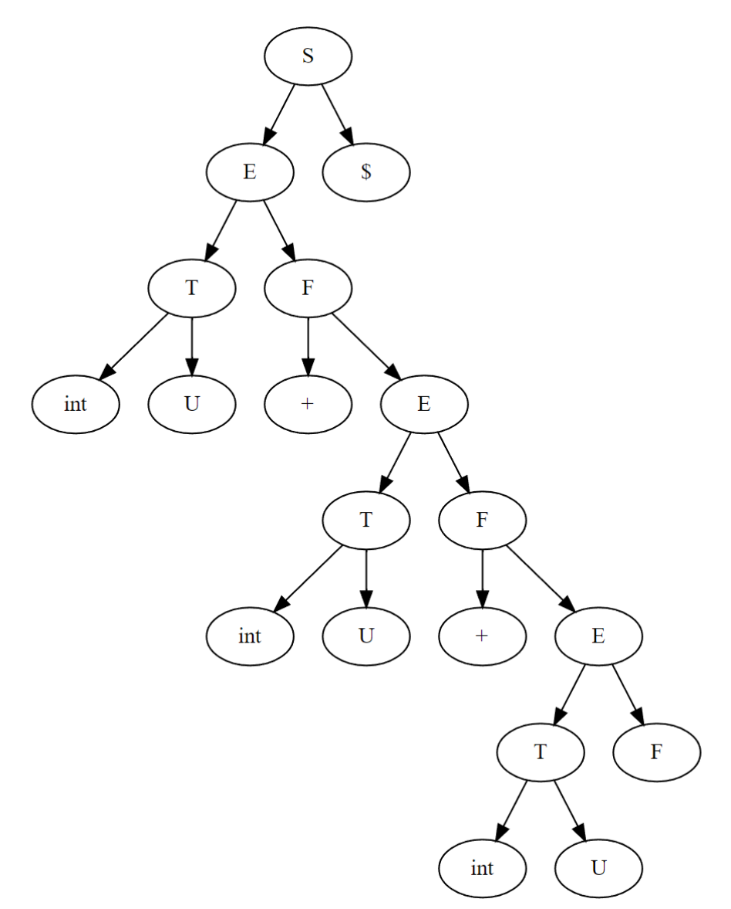
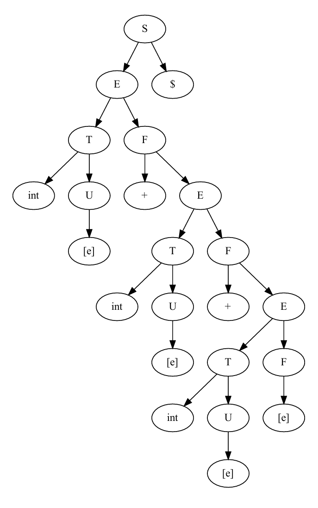

# LL(1) 文法实验（2）

## 实验目的

二、实验目的

要求输入：任意的上下文无关文法。

输出：

1. 是否为 LL(1)文法；
2. 若是 LL(1)文法，输出每条产生式的 select 集；
3. 若不是 LL(1)文法，看看是否含有左公共因子或者含有左递归，并用相应的算法将非 LL(1)文法变成 LL(1)文法，并输出新文法中每条产生式的 select 集。
4. 用**预测分析法（表驱动）**分析文法 G 的正确句子和错误句子

## 实验内容

本次实验，我分别实现了 Recursive Descent 和 Table-Driven 这两种算法实现 LL（1）分析器。

对于 Recursive Descent, 代码放置于 `./recursive_parse.py`，而 `Table-Driven` 算法的测试代码位于 `./ll_1_parse_test.py`。但实际上，核心的算法实现位于 `parser` 包中的 `llparser` 模块，这个模块的代码会在下方附上。

在实际处理过程中，我直接在表驱动分析器中维护了 DFA 的状态，并且记录每个状态的前驱状态。在归约时，快速的进行状态回溯，本质上效果和使用分析表没有算法上的区别。

## Parse Tree 实现

本次实验，我实现了一个可重用的 `ParseTree` 和 `ParseTreeNode` 数据结构，**参见附件 "ParseTree & ParseTreeNode"**

## 实验结果

对于合法的 LL(1) 文法，两种方法均可以成功识别合法的句子，并且给出 Parse Tree 的结构（使用 `Graphviz` 进行可视化：

所分析的句子： `1+3+2$`





## 源代码

### ll_1_parse_test.py

```python
from cfg import *
import reg_exp as reg
import lexical_analyzer as la
from pprint import pprint
from loguru import logger
from parser import ll as llparser


def main():
    program_str = "1+3+2$"

    # Lexical Analyzer Part

    reg_single_dec_number = reg.CharListExpr("0123456789")

    reg_int = reg.MulExpr(
        reg_single_dec_number,
        reg.WildCardExpr(reg_single_dec_number),
    )
    reg_add = reg.CharExpr("+")
    reg_left_para = reg.CharExpr("(")
    reg_right_para = reg.CharExpr(")")
    reg_mul = reg.CharExpr("*")
    reg_white = reg.CharListExpr("\n ")
    reg_whites = reg.MulExpr(
        reg_white,
        reg.WildCardExpr(reg_white),
    )
    reg_eof = reg.CharExpr("$")

    lexical_analyzer = la.LexicalAnalyzer(
        token_definitions=[
            la.TokenDefinition("int", reg_int),
            la.TokenDefinition("+", reg_add),
            la.TokenDefinition("*", reg_mul),
            la.TokenDefinition("white", reg_whites),
            la.TokenDefinition("(", reg_left_para),
            la.TokenDefinition(")", reg_right_para),
            la.TokenDefinition("$", reg_eof),
        ],
        use_dfa=True,
    )

    program_token_list = lexical_analyzer.parse(program_str)
    program_token_list = [t for t in program_token_list if t.token_type != "white"]

    print("Tokens:")
    for i in program_token_list:
        print(i)

    # CFG Part

    terminal_int = Terminal(name="int")
    terminal_add = Terminal(name="+")
    terminal_mul = Terminal(name="*")
    terminal_eof = Terminal(name="$")
    terminal_left_para = Terminal(name="(")
    terminal_right_para = Terminal(name=")")
    non_terminal_s = NonTerminal(name="S")
    non_terminal_e = NonTerminal(name="E")
    non_terminal_f = NonTerminal(name="F")
    non_terminal_t = NonTerminal(name="T")
    non_terminal_u = NonTerminal(name="U")

    cfg_sys_for_left_factoring_test = CFGSystem(
        production_list=[
            Production(
                source=non_terminal_s,
                target=Derivation(pieces=[non_terminal_e, terminal_eof]),
            ),
            Production(
                source=non_terminal_e,
                target=Derivation(
                    pieces=[non_terminal_e, terminal_add, non_terminal_e]
                ),
            ),
            # Production(source=non_terminal_e, target=Derivation(pieces=[non_terminal_e, terminal_mul, non_terminal_e])),
            # Production(source=non_terminal_e,
            #            target=Derivation(pieces=[terminal_left_para, non_terminal_e, terminal_right_para])),
            Production(source=non_terminal_e, target=Derivation(pieces=[terminal_int])),
        ],
        entry=non_terminal_s,
    )

    cfg_sys = CFGSystem(
        production_list=[
            # E = T | T + E
            # T = (E) | int | int * T
            # S = E EOF
            Production(
                source=non_terminal_s,
                target=Derivation(pieces=[non_terminal_e, terminal_eof]),
            ),
            # E = T F
            Production(
                source=non_terminal_e,
                target=Derivation(pieces=[non_terminal_t, non_terminal_f]),
            ),
            # F = epsilon
            Production(source=non_terminal_f, target=Derivation(pieces=None)),
            # F = + E
            Production(
                source=non_terminal_f,
                target=Derivation(pieces=[terminal_add, non_terminal_e]),
            ),
            # # F = *T
            # Production(source=non_terminal_f, target=Derivation(pieces=[terminal_mul, non_terminal_t])),
            # T = (E)
            Production(
                source=non_terminal_t,
                target=Derivation(
                    pieces=[terminal_left_para, non_terminal_e, terminal_right_para]
                ),
            ),
            # T = int U
            Production(
                source=non_terminal_t,
                target=Derivation(pieces=[terminal_int, non_terminal_u]),
            ),
            # U = epsilon
            Production(source=non_terminal_u, target=Derivation(pieces=None)),
            # U = * T
            Production(
                source=non_terminal_u,
                target=Derivation(pieces=[terminal_mul, non_terminal_t]),
            ),
        ],
        entry=non_terminal_s,
    )

    print("Used pieces:")
    pprint(cfg_sys.used_pieces)
    print("------------")

    print("Used Non Terminal:")
    pprint(set([i for i in cfg_sys.used_pieces if isinstance(i, NonTerminal)]))

    print("First Set:")
    for k, v in cfg_sys.first_sets.items():
        print(f"First({k}) = {v}")
    print("----------")

    print("Follow Set")
    for k, v in cfg_sys.follow_sets.items():
        print(f"Follow({k}) = {v}")
    print("----------")

    print("Production Dict")
    for k, v in cfg_sys.production_dict.items():
        print(f"{k} -> {v}")
    print("---------------")

    # try generating parse table
    parse_table = llparser.LLParseTable(cfg_system=cfg_sys)

    print(f"\nParse dict:")
    pprint(parse_table.parse_dict)

    parser_instance = llparser.LLParser(
        cfg_system=cfg_sys, epsilon_terminal=Terminal(name="[e]")
    )
    try:
        parse_tree = parser_instance.parse_token(program_token_list)
    except Exception as e:
        logger.error(e)

    parse_tree.to_graphviz().render(directory="./output", view=True)


if __name__ == "__main__":
    main()

```

### parser_ll.py

```python
from copy import copy
from typing import cast
import cfg
from lexical_analyzer import TokenPair

from .. import errors as general_err
from ..parse_tree import ParseTree, ParseTreeNode

__all__ = [
    "LLParser",
    "LLParseTable",
    "NoValidMove",
    "ParseTableConflictError",
]


class LLParseTable:
    """
    Implementation of LL(1) parse table, but using dict and hash algorithm instead of 2-dim array.
    """

    # the Context-Free Grammar of this LL parse table
    cfg_system: cfg.CFGSystem

    # dict to store parse table item.
    # Pattern: parse_table[non_terminal][lookahead] = derivation
    parse_dict: dict[cfg.NonTerminal, dict[cfg.Terminal | None, cfg.Production]]
    """
    Parse dict used in this LL Parse Table.

    Pattern: parse_table[non_terminal][lookahead] = derivation.

    Which means for a current non_terminal, when we have lookahead,
    what derivation we should use for deduction.
    """

    def __init__(self, cfg_system: cfg.CFGSystem):
        self.cfg_system = cfg_system
        self.parse_dict = {}
        self.generate_parse_table()

        # raise error if not entry provided
        if self.cfg_system.entry is None:
            raise general_err.EntryUndefinedError()

    def generate_parse_table(self):
        """
        Try generating parse table for CFG
        """
        for prod in self.cfg_system.production_list:
            source = prod.source
            target = prod.target

            # if target is epsilon, add follow set of source
            if target.pieces is None:
                source_follow_set = self.cfg_system.follow_sets[source]
                for terminal in source_follow_set:
                    self.set(source, terminal, prod)
                continue

            # deal with item in first set
            target_first_set = self.cfg_system.first_sets[target.pieces[0]]
            for terminal in target_first_set:
                self.set(source, terminal, prod)

            # if first set could be epsilon, then add epsilon set
            if not (None in target_first_set):
                continue
            target_follow_set = self.cfg_system.follow_sets[target.pieces[0]]
            for terminal in target_follow_set:
                self.set(source, terminal, prod)

    def get(
        self, non_terminal: cfg.NonTerminal, lookahead: cfg.Terminal | TokenPair | None
    ) -> cfg.Production:
        """
        Try get item from parse dict

        Exceptions:

        Raise ``DerivationNotFoundError`` when item not found in parse table.
        """
        # convert token pair to Terminal instance if needed

        terminal: cfg.Terminal | None = None
        if isinstance(lookahead, TokenPair):
            terminal = cfg.Terminal(name=lookahead.token_type)
        else:
            # assert isinstance(lookahead, cfg.Terminal)
            terminal = lookahead

        try:
            return self.parse_dict[non_terminal][terminal]
        except KeyError:
            raise NoValidMove(non_terminal, terminal)

    def set(
        self,
        non_terminal: cfg.NonTerminal,
        lookahead: cfg.Terminal | None,
        production: cfg.Production,
    ) -> None:
        """
        Try to set item from parse dict

        Raises:
            ParseTableConflictError: when parse table conflict detected.
        :return:
        """
        # check move conflict
        try:
            res = self.get(
                non_terminal, lookahead
            )  # expected to raise DerivationError here

            # item already exists, return
            if res == production:
                return

                # if already have result, then parse table conflict occurred
            raise ParseTableConflictError(non_terminal, lookahead, {res, production})
        except NoValidMove:
            # expected error
            pass

        # add move
        self.parse_dict.setdefault(non_terminal, {})
        self.parse_dict[non_terminal][lookahead] = production


class LLParser:
    parse_table: LLParseTable

    _token_list: list[TokenPair]
    _parsed_count: int
    _total_token_count: int
    _parse_tree: ParseTree
    _lookahead: TokenPair | None
    _epsilon_terminal: cfg.Terminal | None

    def __init__(
        self, cfg_system: cfg.CFGSystem, epsilon_terminal: cfg.Terminal | None = None
    ):
        self._epsilon_terminal = epsilon_terminal
        try:
            # init parse table
            self.parse_table = LLParseTable(cfg_system)
        except Exception as e:
            raise general_err.CFGIncompatibleError(parser_type="LL(1)") from e

    def init_state(self, token_list: list[TokenPair]) -> None:
        """
        Initialize parser for next parsing.
        """
        self._token_list = token_list
        self._total_token_count = len(token_list)
        self._parsed_count = 0

        # init parse tree
        entry_piece = self.parse_table.cfg_system.entry
        if entry_piece is None:
            raise general_err.EntryUndefinedError()
        self._parse_tree = ParseTree(
            start_nodes=[ParseTreeNode(node_type=entry_piece)],
            epsilon_terminal=self._epsilon_terminal,
        )
        self._lookahead = self._token_list[0]

    def parse_token(self, token_list: list[TokenPair]) -> ParseTree:
        """
        Try to parse the input token list.

        Return ParseTree object if success.

        Errors:
        - ``InvalidParseTreeError``
        - ``ParseError``
        - ...
        """
        self.init_state(token_list)

        # set token list
        self._token_list = copy(token_list)

        # loop while not fully parsed
        while self._total_token_count > self._parsed_count:
            self._match_terminal_forward()
            try:
                self._derive_leftmost_non_terminal()
            except NoValidMove as e:
                raise general_err.ParseErrorBase(
                    message="Could not parse the input string"
                ) from e

        # check if parse tree valid
        if not self._parse_tree.is_valid():
            raise general_err.InvalidParseTreeError(self._parse_tree)

        return self._parse_tree

    def _derive_leftmost_non_terminal(self):
        non_terminal_info = self._parse_tree.get_first_non_terminal_info()
        # no terminal found
        if non_terminal_info is None:
            return
            # retrieve info
        index = non_terminal_info[0]
        node = non_terminal_info[1]

        # get source of production
        source = node.node_type
        if not isinstance(source, cfg.NonTerminal):
            raise general_err.DerivationError(source)

        # use parse table to get move
        move_info = self.parse_table.get(source, self._lookahead)

        # update parse tree
        new_pieces = move_info.target.pieces
        self._parse_tree.derive_non_terminal(index, new_pieces, move_info)

    def _match_terminal_forward(self) -> None:
        """
        Try match token list with terminal leaves in parse tree.

        If match success, will update ``_parsed_count`` and ``lookahead``

        Exceptions:
        - ``TokenNotMatchError``
        :return:
        """
        info = self._parse_tree.get_first_non_terminal_info()

        # match range: [match_start, match_end)
        match_start: int = self._parsed_count
        match_end: int = -1
        if info is None:
            match_end = self._total_token_count
        else:
            match_end = info[0]

        # skip if no need to forward
        if match_start >= match_end:
            return

            # loop to check if all newly derived terminal match the corresponding token pair
        for idx in range(match_start, match_end):
            # retrieve info
            token_pair = self._token_list[idx]
            node_type: cfg.Piece = self._parse_tree.leaves[idx].node_type

            # it should be terminal if the get_first_non_terminal_info() method is correct
            node_type = cast("cfg.Terminal", node_type)

            is_match = token_pair.is_match(node_type)

            # if piece and token not match, raise error
            if not is_match:
                raise general_err.TokenNotMatchError(
                    token=self._token_list[idx], piece=node_type, index=idx
                )

        # match success, update parsed index and lookahead
        self._parsed_count = match_end
        if self._parsed_count >= self._total_token_count:
            self._lookahead = None
        else:
            self._lookahead = self._token_list[match_end]


class NoValidMove(Exception):
    def __init__(self, non_terminal: cfg.NonTerminal, lookahead: cfg.Terminal | None):
        super().__init__(
            f"Could not found derivation for NonTerminal {non_terminal} with lookahead {lookahead}"
        )


class ParseTableConflictError(Exception):
    def __init__(
        self,
        non_terminal: cfg.NonTerminal,
        lookahead: cfg.Terminal | None,
        conflict_moves: set[cfg.Production],
    ):
        super().__init__(
            f"Move conflict occurred when generating LL(1) Parse Table on "
            f"NonTerminal {non_terminal} with lookahead {lookahead}. "
            f"Sets of conflict moves: {conflict_moves}, "
            f"perhaps a left factoring is needed. "
        )
```

### recursive_parse.py

```python
"""
This module try to use a recursive descent method
to deal with the same example CFG in the test.
"""

from loguru import logger

from parser.parse_tree import ParseTree, ParseTreeNode
from lexical_analyzer import TokenPair
import cfg
import lexical_analyzer as la
import reg_exp as reg


def recursive_parse(tokens, current_position, non_terminal):
    """Recursive descent parser based on the provided grammar."""

    # Base case for empty input (End of input)
    if current_position >= len(tokens):
        raise ValueError(f"Unexpected end of input while parsing {non_terminal}")

    token = tokens[current_position]

    # If the current symbol is a terminal, match it
    if isinstance(non_terminal, cfg.Terminal):
        if token.token_type == non_terminal.name:
            # Match terminal, move to next token
            node_content = TokenPair(token.token_type, token.content)
            node = ParseTreeNode(non_terminal, node_content)
            return node, current_position + 1
        else:
            raise ValueError(
                f"Expected {non_terminal.name}, but found {token.token_type} at position {current_position}"
            )

    # Recursive case for non-terminals:
    if non_terminal == cfg.NonTerminal("S"):
        # S -> E EOF
        node_e, pos = recursive_parse(tokens, current_position, cfg.NonTerminal("E"))
        if tokens[pos].token_type != "$":
            raise ValueError(f"Expected EOF, but found {tokens[pos].token_type}")
        node_eof = ParseTreeNode(cfg.Terminal("$"), TokenPair("$", "$"))
        node = ParseTreeNode(cfg.NonTerminal("S"), pointers=[node_e, node_eof])
        return node, pos + 1

    elif non_terminal == cfg.NonTerminal("E"):
        # E -> T F
        node_t, pos = recursive_parse(tokens, current_position, cfg.NonTerminal("T"))
        node_f, pos = recursive_parse(tokens, pos, cfg.NonTerminal("F"))
        node = ParseTreeNode(cfg.NonTerminal("E"), pointers=[node_t, node_f])
        return node, pos

    elif non_terminal == cfg.NonTerminal("F"):
        # F -> ε | + E
        if (
            current_position < len(tokens)
            and tokens[current_position].token_type == "+"
        ):
            # F -> + E
            node_add = ParseTreeNode(cfg.Terminal("+"), TokenPair("+", "+"))
            node_e, pos = recursive_parse(
                tokens, current_position + 1, cfg.NonTerminal("E")
            )
            node = ParseTreeNode(cfg.NonTerminal("F"), pointers=[node_add, node_e])
            return node, pos
        else:
            # F -> ε (epsilon, no children)
            node = ParseTreeNode(cfg.NonTerminal("F"))
            return node, current_position

    elif non_terminal == cfg.NonTerminal("T"):
        # T -> ( E ) | int U
        if tokens[current_position].token_type == "(":
            # T -> ( E )
            node_left_para = ParseTreeNode(cfg.Terminal("("), TokenPair("(", "("))
            node_e, pos = recursive_parse(
                tokens, current_position + 1, cfg.NonTerminal("E")
            )
            if tokens[pos].token_type != ")":
                raise ValueError(f"Expected ')', but found {tokens[pos].token_type}")
            node_right_para = ParseTreeNode(cfg.Terminal(")"), TokenPair(")", ")"))
            node = ParseTreeNode(
                cfg.NonTerminal("T"), pointers=[node_left_para, node_e, node_right_para]
            )
            return node, pos + 1
        elif tokens[current_position].token_type == "int":
            # T -> int U
            node_int = ParseTreeNode(cfg.Terminal("int"), TokenPair("int", "int"))
            node_u, pos = recursive_parse(
                tokens, current_position + 1, cfg.NonTerminal("U")
            )
            node = ParseTreeNode(cfg.NonTerminal("T"), pointers=[node_int, node_u])
            return node, pos
        else:
            raise ValueError(
                f"Expected '(' or 'int', but found {tokens[current_position].token_type} at position {current_position}"
            )

    elif non_terminal == cfg.NonTerminal("U"):
        # U -> ε | * T
        if (
            current_position < len(tokens)
            and tokens[current_position].token_type == "*"
        ):
            # U -> * T
            node_mul = ParseTreeNode(cfg.Terminal("*"), TokenPair("*", "*"))
            node_t, pos = recursive_parse(
                tokens, current_position + 1, cfg.NonTerminal("T")
            )
            node = ParseTreeNode(cfg.NonTerminal("U"), pointers=[node_mul, node_t])
            return node, pos
        else:
            # U -> ε (epsilon, no children)
            node = ParseTreeNode(cfg.NonTerminal("U"))
            return node, current_position

    else:
        raise ValueError(f"Unrecognized non-terminal: {non_terminal}")


def parse(program_str):

    # Lexical Analyzer Part
    reg_single_dec_number = reg.CharListExpr("0123456789")

    reg_int = reg.MulExpr(
        reg_single_dec_number,
        reg.WildCardExpr(reg_single_dec_number),
    )
    reg_add = reg.CharExpr("+")
    reg_left_para = reg.CharExpr("(")
    reg_right_para = reg.CharExpr(")")
    reg_mul = reg.CharExpr("*")
    reg_white = reg.CharListExpr("\n ")
    reg_whites = reg.MulExpr(
        reg_white,
        reg.WildCardExpr(reg_white),
    )
    reg_eof = reg.CharExpr("$")

    lexical_analyzer = la.LexicalAnalyzer(
        token_definitions=[
            la.TokenDefinition("int", reg_int),
            la.TokenDefinition("+", reg_add),
            la.TokenDefinition("*", reg_mul),
            la.TokenDefinition("white", reg_whites),
            la.TokenDefinition("(", reg_left_para),
            la.TokenDefinition(")", reg_right_para),
            la.TokenDefinition("$", reg_eof),
        ],
        use_dfa=True,
    )

    program_token_list = lexical_analyzer.parse(program_str)
    program_token_list = [t for t in program_token_list if t.token_type != "white"]

    try:
        parse_tree_node, _ = recursive_parse(
            program_token_list, 0, cfg.NonTerminal("S")
        )
        return ParseTree([parse_tree_node])
    except ValueError as e:
        logger.error(f"Parsing error: {e}")
        raise


# Example of using the recursive_parse function
program_str = "1+3+2$"
parse_tree = parse(program_str)
parse_tree.to_graphviz().render(
    filename="recursive_parse", directory="./graphviz", view=True
)

```

-----

附件：

# ParseTree & ParseTreeNode

## About ParseTreeNode and pointers

When designing the usage of `ParseTree` and `ParseTreeNode`, the `ParseTreeNode` object are designed to reused and
linked by reference of Node instance itself.

This is different from the thought when designing Finite Automata, where we use `nid` _(A string or a number that
unique across different nodes)_ . Actually I was regret that I didn't use direct instance ref at that time for `fa`
module.

## Epsilon Node

When initializing a ParseTree, it's required to provide an $\varepsilon$ terminal.

This is because we use `None` to represent $\varepsilon$ in this packages, however when a node is derived into $\varepsilon$, we need to actually link it to a Epsilon node, otherwise this node will be left in the leaves as non-terminal.

Once a $\varepsilon$ terminal has been pass to parse tree, the parse tree will use such terminal to generate **Epsilon Node** everytime it's used.

We could not directly cache the _Epsilon Node_, since different node that has been derived to $\varepsilon$ should actually link to it's own child _Epsilon Node_.

## Corresponding Production Info

For each node, we may store the corresponding Production info that related to this node. Checkout this example:


The **corresponding Production should represents the relationship of this node and its children nodes**.

---

**Usage Of Corresponding Production**

The Corresponding Production info is **useful when we trying to use a Rule-Based system to convert Parse Tree to Abstract Syntax Tree**. We could specify the rules for every single Production that how to convert ParseTreeNode to ASTNode which has this kinds of Production.

# Design of ParseTree

The ParseTree class should be designed to serve several different Parsing Algorithm for example `LL(1)`, `SLR`,
`CLR` etc.

There is two basic types of those Algorithm: Top-down and Bottom-up.

To support these two types of algorithm simultaneously, we define and keep track of two things in this class:

- `entries`
- `leaves`

They are both a `list[ParseTreeNode]` object. `entries` stores the current top nodes, and `leaves` tracks the leaves
nodes.

## For Top-down Algorithms

When using ParseTable in Top-down algorithms, we generally first initialize the `entries` to be the Entry NonTerminal,
For example the `S` node, so does `leaves` _(because at this time the leaves of the tree is also the Entry
NonTerminal)._

Then when Parser going on and want to do Derivation on some leave nodes. (Usually is the left-most NonTerminal in
`leaves`), we directly update the pointer of the nodes that we want to derive, let it point to the new derived nodes.
Then remove this node from `leaves`, add new nodes to `leaves` to replace this node.

For example we want to do `1 -> 2, 3`, then we found `1` in `leaves`, point `1` to `2, 3`, then replace `1` in
`leaves` with `2, 3`.

When all things finished and parse success, the `leaves` nodes should all be `Terminal` and should match the
sequence of input list of `TokenPairs`.

## For Bottom-up Algorithms

At the beginning, initialize both `entries` and `leaves` to list of `Terminal` matched the input list of `TokenPairs`

When doing Reduction on some nodes, we first found these nodes in `entries`, create a new node that point to these
node, then replace these nodes in `entries` with the newly created nodes.

For example, if we want reduction like `node1 <- node2, node3, node4`, We first create new node `node1`, point it to
the three
nodes, then replace `node2, node3, node4` in `entries` with `node1`.

When finished, `entries` should become a list of single Node that matches the Entry NonTerminal type.
